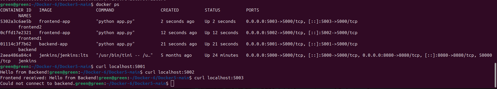

### Lab 13: Custom Docker Network for Microservices
### Objective

In this lab, we will:

Build Docker images for frontend and backend microservices.

Create a custom Docker network to connect them.

Run multiple containers with different networks.

Verify container communication and network isolation.

### Step 1: Clone the Application Code
git clone https://github.com/Ibrahim-Adel15/Docker5.git

cd Docker5

### Step 2: Write Dockerfile for Frontend

Create frontend/dockerfile.frontend:
```bash 
# Use Python base image
FROM python:3.9-slim

# Set working directory
WORKDIR /app

# Copy all files
COPY . .

# Install required packages
RUN pip install -r requirements.txt

# Expose port 5000
EXPOSE 5000

# Run the frontend application
CMD ["python", "app.py"]
```
### Step 3: Write Dockerfile for Backend

Create backend/dockerfile.backend:
```
# Use Python base image
FROM python:3.9-slim

# Set working directory
WORKDIR /app

# Copy all files
COPY . .

# Install Flask
RUN pip install flask

# Expose port 5000
EXPOSE 5000

# Run the backend application
CMD ["python", "app.py"]
```
### Step 4: Build Docker Images
### Build frontend image
```
docker build -t frontend-app -f frontend/Dockerfile.frontend .
```
### Build backend image
```
docker build -t backend-app -f backend/Dockerfile.backend .
```
### Step 5: Create a Custom Docker Network
docker network create --subnet=192.168.0.0/24 ivolve-network


Verify:
```
docker network ls
docker network inspect ivolve-network
```
### Step 6: Run Containers
Run Backend
```
docker run -d --name backend --network ivolve-network -p 5001:5000 backend-app
```
Run Frontend (frontend1) on Custom Network
```
docker run -d --name frontend1 --network ivolve-network -p 5002:5000 frontend-app
```
Run Another Frontend (frontend2) on Default Network
```
docker run -d --name frontend2 -p 5003:5000 frontend-app
```
### Step 7: Verify Communication

Containers on the same network can communicate:
```
docker exec -it frontend1 ping backend
```

Containers on different networks cannot:
```
docker exec -it frontend2 ping backend
```
### Step 8: Test via Browser or Curl
Container	URL to Test	Expected Result
backend	
```
curl localhost:5001
```
Backend running
frontend1	
```
curl localhost:5002
```
Frontend connects to backend
frontend2
```
curl localhost:5003
```
Frontend runs but can’t reach backend



### Step 9: Cleanup
```
docker rm -f frontend1 frontend2 backend
docker network rm ivolve-network
```
### Key Takeaways

Custom Docker networks allow containers to communicate using names.

Containers on different networks cannot communicate unless explicitly connected.

Port mapping lets you access containerized services from your host system.
