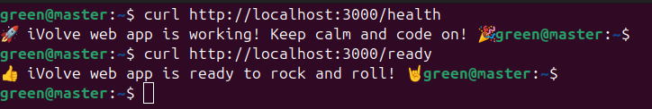
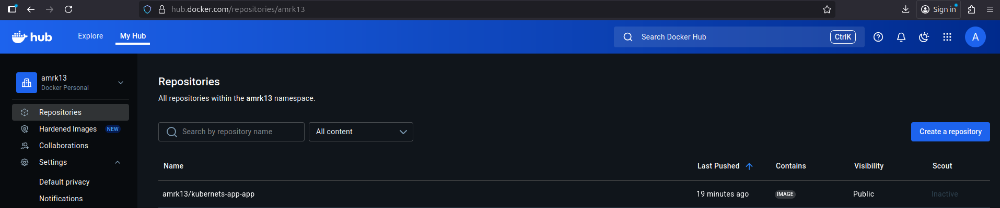

# Lab 14: Containerized Node.js and MySQL Stack Using Docker Compose

###  Objective
Deploy a Node.js application connected to a MySQL database using **Docker Compose**.  
The app requires a database named **ivolve** to start properly.

---

### Step 1: Clone the Application Repository
```bash
git clone https://github.com/Ibrahim-Adel15/kubernets-app.git
cd kubernets-app
```
### Step 2: Create Dockerfile
If not already available, create a Dockerfile for the Node.js app.

dockerfile
```bash
# Dockerfile
FROM node:18

WORKDIR /app

COPY package*.json ./
RUN npm install

COPY . .

EXPOSE 3000

CMD ["npm", "start"]
```
### Step 3: Create docker-compose.yml
Create a docker-compose.yml file to define both services: app and db.

```bash
version: '3.8'

services:
  app:
    build: .
    container_name: node_app
    ports:
      - "3000:3000"
    environment:
      DB_HOST: db
      DB_USER: root
      DB_PASSWORD: root
    depends_on:
      - db
    volumes:
      - ./logs:/app/logs

  db:
    image: mysql:8
    container_name: mysql_db
    environment:
      MYSQL_ROOT_PASSWORD: root
      MYSQL_DATABASE: ivolve
    volumes:
      - db_data:/var/lib/mysql

volumes:
  db_data:
```
### Step 4: Build and Run the Containers
```bash
docker compose up -d --build
```
Verify running containers:

```bash
docker ps
```
### Step 5: Verify Application Functionality
Check App in Browser
Open: 
```bash 
http://localhost:3000
```
Health and Readiness Checks
```bash
curl http://localhost:3000/health
curl http://localhost:3000/ready
```


###  Step 6: Verify Application Logs
Logs are stored under /app/logs inside the container and locally at ./logs.

```bash
cat logs/access.log
```
Or inside the container:
```bash
docker exec -it node_app cat /app/logs/access.log
```
### Step 7: Push the App Image to DockerHub
### Login to DockerHub
```bash
docker login
```
Find the Image
```bash
docker images
```
Locate the image name (e.g. kubernets-app-app).

### Tag the Image
Replace <your_dockerhub_username> with your actual username:
```bash
docker tag kubernets-app_app:latest <your_dockerhub_username>/kubernets-app-app
```
### Push the Image
```bash
docker push <your_dockerhub_username>/kubernets-app-app
```
### Verify on DockerHub
Visit your DockerHub account → Repositories → Confirm that kubernets-app has been uploaded successfully.



